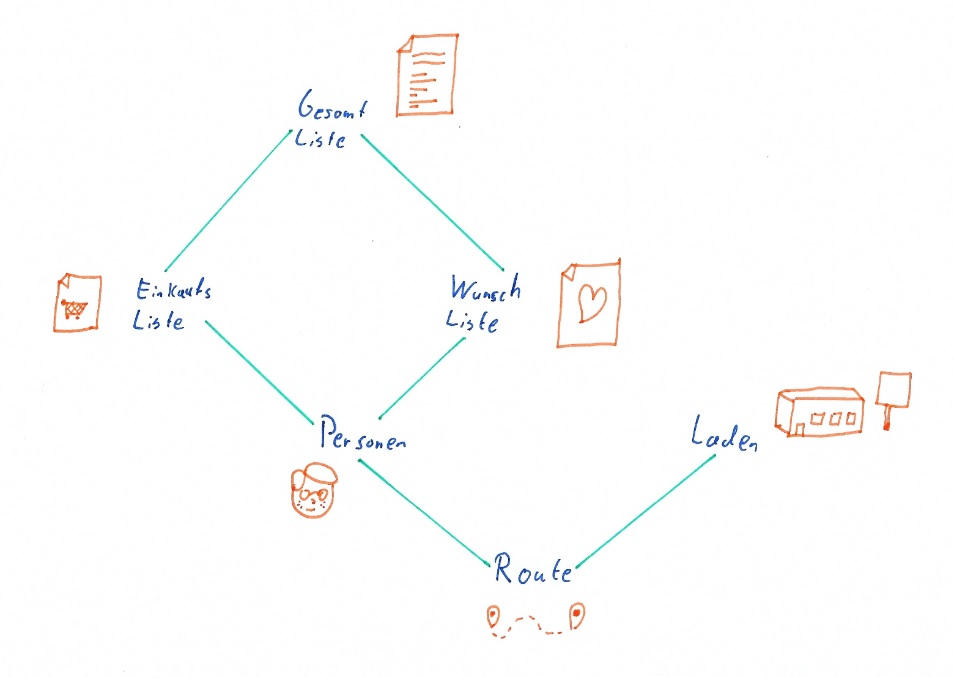

# WBA2SS18FaustTissenSchoemaker
### Medieninformatik TH Köln - WBA2 Sommersemester 2018

## Projekt Idee

### Partyplaner
Die vier Freunde Anna, Basti, Christina und Daniel wollen eine 
Grillparty veranstalten. Jeder soll Wünsche äußern können, was es auf der 
Grillparty zu Essen und Trinken gibt. Sie wollen nicht, dass die Besorgung der Produkte an einer Person hängen bleibt.

Jeder der Vier soll
einen Teil besorgen und es soll sichergestellt werden, dass möglichst wenig unterschiedlichen Läden angefahren werden müssen.

##### Funktionen
* Jeder Benutzer kann Produkte hinzufügen (z.B. Würstchen, Brot, Grillkohle, Ketchup).
* Die Produkte werden mit Tags von den Benutzern versehen, welche beschreiben, wo das Produkt gekauft werden kann (z.B. Getränkemarkt, Fleischerei).
* Mehrfache Einträge werden gematched und mit Markierung zusammengefasst.
* Nach Abschluss der Äußerung der Wünsche, werden den Benutzern Einkauforte und damit verbundene Produkte zugewiesen.

##### Externe Services
* Firebase für Datenbank

### Domänenmodell

### Anforderungen
* Anwendungslogik
* API Nutzung
* REST
* Mehrwert muss erkennbar sein